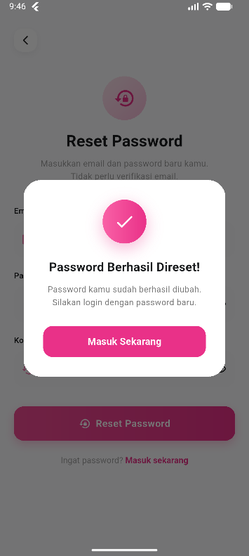

# finora

# Finora - Personal Finance Mobile App

Finora adalah aplikasi mobile yang dirancang untuk membantu pengguna mengelola keuangan pribadi secara menyeluruh, aman, dan efisien. Aplikasi ini memungkinkan pengguna mencatat pemasukan dan pengeluaran, menetapkan budget, memantau target tabungan, dan mendapatkan notifikasi real-time agar keuangan tetap terkontrol dan terstruktur.
---

## Fitur Utama

- **Login & Register**  
  Akses aman untuk pengguna baru dan lama. Pengguna baru dapat mendaftar dengan nama, email, dan kata sandi. Sistem autentikasi memastikan hanya pengguna terverifikasi yang bisa mengakses aplikasi.
    

- **Dashboard Keuangan**  
  Halaman utama menampilkan ringkasan finansial, total saldo, pemasukan, pengeluaran, dan distribusi per kategori dalam bentuk grafik interaktif.

- **Pencatatan Pemasukan & Pengeluaran**  
  Pengguna dapat mencatat setiap transaksi harian dengan detail kategori, nominal, tanggal, dan catatan tambahan. Data tersimpan di database untuk analisis lebih lanjut.

- **Profil Pengguna**  
  Kelola informasi akun, update data pribadi, dan ubah kata sandi secara mandiri:contentReference[oaicite:4]{index=4}.

- **Target Tabungan**  
  Tentukan tujuan finansial seperti dana darurat atau kebutuhan masa depan. Perkembangan tabungan ditampilkan dalam progress bar real-time.

- **Notifikasi**  
  Pemberitahuan otomatis terkait arus masuk dan keluar keuangan dari pengguna.
  

- **Edit / Hapus Transaksi**  
  Memperbaiki atau menghapus transaksi untuk menjaga keakuratan data keuangan.

- **Kategori Transaksi**  
  Mengelompokkan pemasukan dan pengeluaran berdasarkan jenis, misal makanan, transportasi, hiburan, atau gaji. Bisa ditambah atau disesuaikan oleh pengguna.
---

## Arsitektur Sistem

Finora menggunakan arsitektur **MVVM + Repository Pattern** untuk memisahkan UI, logika bisnis, dan sumber data agar lebih terstruktur dan mudah dipelihara.  
Lapisan utama:
- **Activity / Fragment** → halaman yang dilihat pengguna  
- **ViewModel** → penghubung UI dan data  
- **Repository** → pengelola aliran data  
- **Model** → struktur data aplikasi  
- **Room / SQLite** → penyimpanan lokal  
- **Remote Data Source / Retrofit** → akses API/server  
- **Webservice** → layanan backend


---

## Role Pengguna
Pengguna adalah peran utama aplikasi. Seluruh fitur dirancang untuk mendukung aktivitas finansial mereka sehari-hari, termasuk pencatatan transaksi, pengaturan budget, dan pemantauan target tabungan.

---

## Instalasi
1. Clone repo:
   ```bash
   git clone https://github.com/username/Finora.git

## Getting Started

This project is a starting point for a Flutter application.

A few resources to get you started if this is your first Flutter project:

- [Lab: Write your first Flutter app](https://docs.flutter.dev/get-started/codelab)
- [Cookbook: Useful Flutter samples](https://docs.flutter.dev/cookbook)

For help getting started with Flutter development, view the
[online documentation](https://docs.flutter.dev/), which offers tutorials,
samples, guidance on mobile development, and a full API reference.
