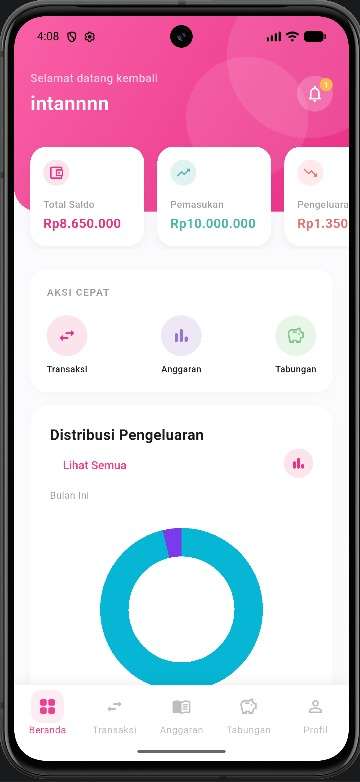
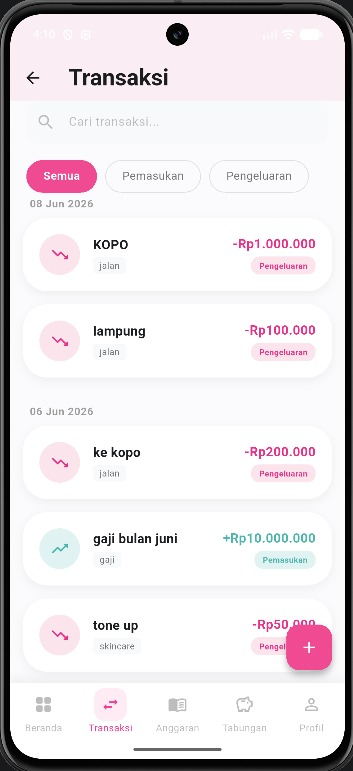
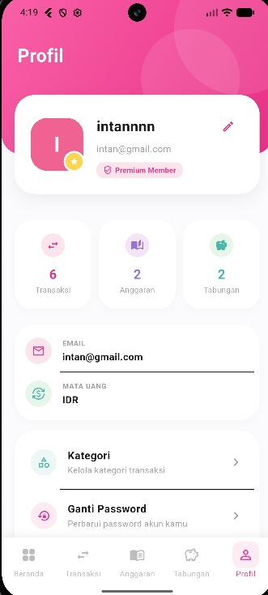

# Finora

<div align="center">

### Personal Finance Mobile Application

A modern mobile application that helps users manage personal finances, track expenses, monitor savings goals, and build better financial habits.


</div>

---

## Overview

Finora is a personal finance mobile application developed to help users manage their financial activities efficiently and securely. The application provides various features for recording transactions, monitoring savings goals, categorizing expenses, and visualizing financial information through an intuitive user interface.

---

## Application Screenshots

<table align="center">
<tr>
<td align="center">
<br>
<b>Dashboard</b>
</td>

<td align="center">
<br>
<b>Transaction</b>
</td>

<td align="center">
<br>
<b>Profile</b>
</td>
</tr>
</table>

---

## Key Features

### Authentication System

* User registration and login.
* Secure authentication system.
* Account management.

### Financial Dashboard

* Display account balance.
* Monitor income and expenses.
* Financial summaries and statistics.

### Transaction Management

* Record income and expenses.
* Categorize transactions.
* Edit and delete transaction history.

### Savings Goals

* Set financial targets.
* Monitor savings progress.
* Real-time progress tracking.

### User Profile

* View and update personal information.
* Change account credentials.
* Manage user settings.

### Notifications

* Financial reminders.
* Transaction updates.
* Activity notifications.

---

## System Architecture

Finora implements the **Model-View-ViewModel (MVVM)** architecture combined with the **Repository Pattern** to ensure clean code structure and maintainability.

### Architecture Layers

* View (Activity / Fragment)
* ViewModel
* Repository
* Model
* SQLite Database
* API Service
* Backend Service

```text
Presentation Layer
        ↓
     ViewModel
        ↓
     Repository
        ↓
Database / API Service
```

---

## Technologies

| Technology         | Description                     |
| ------------------ | ------------------------------- |
| Flutter            | Cross-platform mobile framework |
| Dart               | Programming language            |
| SQLite             | Local database                  |
| MVVM               | Application architecture        |
| Repository Pattern | Data management approach        |
| REST API           | Backend communication           |

---

## Project Structure

```text
Finora/
│
├── Backend/          # Backend services
├── Frontend/         # Mobile application source code
├── DetailsPage/      # Additional application pages
├── Screenshots/      # Application screenshots
│
└── README.md
```

---

## Installation

Clone the repository:

```bash
git clone https://github.com/username/finora.git
```

Navigate to the project directory:

```bash
cd finora/Frontend
```

Install dependencies:

```bash
flutter pub get
```

Run the application:

```bash
flutter run
```

---

## Future Enhancements

* Budget planning and analysis.
* Financial report generation.
* Cloud synchronization.
* Dark mode support.
* Financial insights and analytics.

---

<div align="center">

### 💙 Finora — Your Smart Financial Companion

Helping users build better financial habits through technology.

</div>
